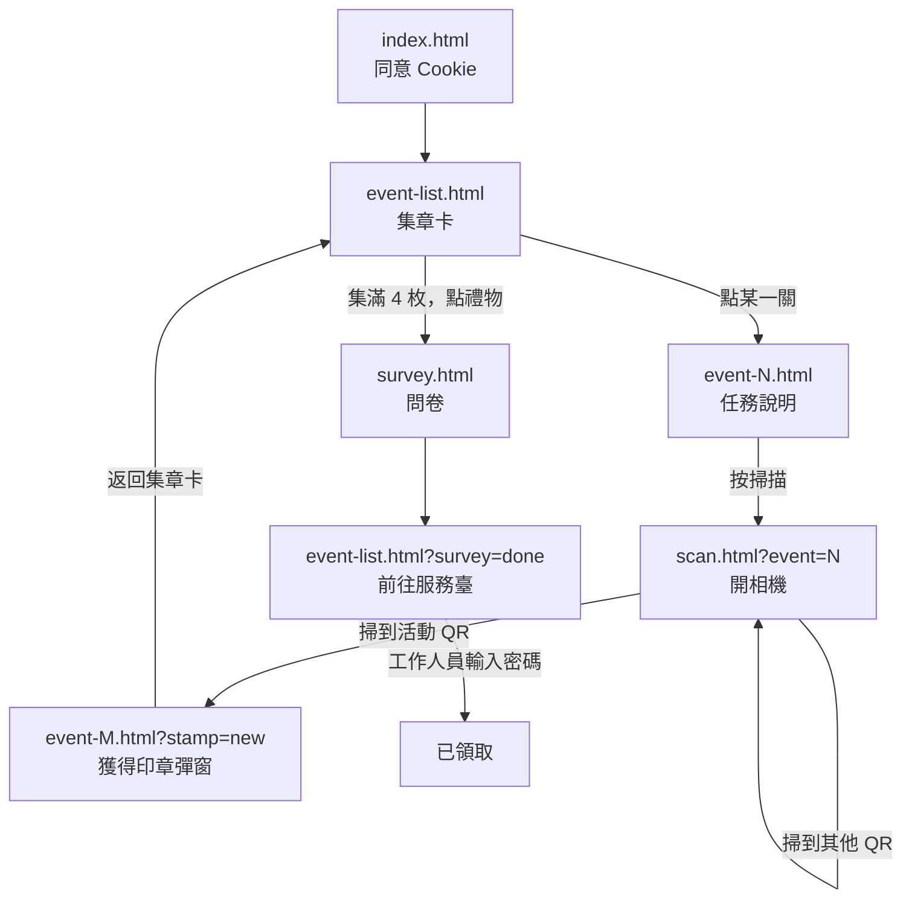

# 人生設計夢工場 — 集章活動網站

教育部主題館《人生設計夢工場—人生100、設計未來》的行動裝置集章活動頁。
參觀者到各展區完成任務、掃描攤位 QR code 集章，集滿 4 枚後填寫問卷，
至服務臺由工作人員輸入密碼兌換獎品。

---

## 技術取向

**純靜態網站，沒有建置流程，沒有套件管理。**

- 原生 HTML / CSS / JavaScript，不使用任何前端框架
- 不需要 `npm install`、不需要編譯，改完檔案重整瀏覽器就看得到
- 唯一的外部相依是 `assets/js/vendor/jsQR.js`（QR 解碼），已放進專案內，不走 CDN
- 全部狀態存在瀏覽器的 `localStorage`

會這樣做是因為部署環境是**靜態主機**（不能執行 PHP 或 Node），
只能上傳檔案。這個限制也決定了下面幾個「已知限制」。

## 本機預覽

需要透過 HTTP 開啟，**不能直接用 `file://` 開檔案** — 相機與密碼驗證都需要
安全環境（HTTPS 或 localhost），用 `file://` 會失效。

```bash
# 方式一：VS Code 的 Live Server（專案已設定 port 5501）
# 方式二：
python3 -m http.server 8000
# 然後開 http://localhost:8000
```

---

## 檔案結構

```
index.html          入口：Banner、Cookie 同意、「開始蒐集」
event-list.html     集章卡主畫面：Loading、4 格印章、兌獎流程彈窗
event-1~4.html      各關卡內頁：任務說明、掃描按鈕
scan.html           相機掃描頁
survey.html         滿意度問卷
description.html    使用說明
privacy.html        隱私權政策
stats.html          後台數據頁（密碼登入，未連結於任何頁面）

assets/
  css/style.css         全站樣式（頁面專屬樣式寫在各頁 <head> 的 <style>）
  js/app.js             全站共用模組，每一頁都載入
  js/event-detail.js    關卡內頁邏輯（event-1~4 共用）
  js/scan.js            掃描頁邏輯
  js/vendor/jsQR.js     QR 解碼函式庫

server/             後端 API（Node + SQLite，跑在主機的 Docker 容器）
  server.js             API 本體：記錄瀏覽、驗證兌獎密碼、統計查詢
  Dockerfile            node:24-alpine，無 npm 相依

deploy/             部署設定與說明
  README.md             主機架構、更新流程、備份、現場風險
  run-api.sh           在主機上建置並啟動 API 容器
  nginx/                nginx 站台設定
  docker-compose.yml    參考用（主機無 compose plugin）
```

### 各頁載入的 script

| 頁面 | app.js | 其他 |
|---|:---:|---|
| index / description / privacy / survey / event-list | ✓ | |
| event-1~4 | ✓ | `event-detail.js` |
| scan | ✓ | `vendor/jsQR.js`、`scan.js` |
| stats | ✗ | 刻意不載入 — 後台不需要集章邏輯，也不該被計入瀏覽人次 |

---

## 使用者流程



**集章只會發生在掃描頁。** 關卡內頁不會自己集章，它只負責顯示任務與導向掃描頁；
掃到哪一關的 QR 就集哪一關的章，與使用者從哪一關進入無關
（QR 實體貼在攤位上，走錯關卡也不該掃不到）。

---

## 核心模組（`assets/js/app.js`）

| 模組 | 職責 |
|---|---|
| `EVENTS` | 關卡設定：編號 → 名稱與印章色系。**改關卡名稱只要改這裡** |
| `parseScanResult()` | 解析掃描內容，回傳關卡編號或 `null` |
| `Stamps` | 集章狀態：`load` / `has` / `collect` / `isComplete` |
| `Progress` | 問卷與兌獎狀態 |
| `Redeem.verify()` | 兌獎密碼驗證（非同步，回傳 Promise） |
| `Analytics` | 瀏覽／兌獎人次記錄（端點未設定時完全不送） |
| `Popup` | 全站彈窗管理：顯示、關閉、點背景與 ESC 關閉 |
| `CookieConsent` | Cookie 同意列 |
| `Orientation` | 行動裝置橫向鎖定 |

`app.js` 於 `DOMContentLoaded` 自動初始化 Popup、Orientation、CookieConsent、
Analytics，**新增頁面只要載入 `app.js` 就自動具備這些行為**，不必再貼任何程式碼。

### 橫向鎖定的做法

`Orientation` 偵測到行動裝置橫向時，只在 `<body>` 加上 `landscape-locked` class，
顯示與隱藏交給 CSS：

```css
body.landscape-locked .container { display: none; }
body.landscape-locked #upright   { display: flex; }
```

提示用的 `#upright` 元素由 JS 自動插入，各頁面不需要重複貼 markup。

---

## 資料儲存

全部存在 `localStorage`（`STORAGE_KEYS`）：

| Key | 內容 |
|---|---|
| `collectedStamps` | 已集章的關卡編號陣列，例如 `[1,3]` |
| `surveyCompleted` | 問卷是否完成 |
| `surveyAnswers` | 問卷作答內容 |
| `redeemed` | 是否已兌換 |
| `cookieConsent` | Cookie 同意狀態 |
| `deviceId` | 統計用的隨機裝置代碼，不含個資 |

`sessionStorage` 另存 `visitTracked`，讓瀏覽人次每個工作階段只記錄一次。

`Stamps.load()` 會過濾掉不存在的關卡編號，也會吞掉壞掉的 JSON，
所以使用者手動改 localStorage 不會讓頁面壞掉。

---

## QR 掃描

各攤位 QR code 的內容：

| 關卡 | 科別 | QR 內容 |
|---|---|---|
| 1 | 高等教育司 | `https://ccu-healthyage.com/scan/1` |
| 2 | 資訊及科技教育司 | `https://ccu-healthyage.com/scan/2` |
| 3 | 技術及職業教育司 | `https://ccu-healthyage.com/scan/3` |
| 4 | 終身教育司 | `https://ccu-healthyage.com/scan/4` |

`scan.js` 有原生 `BarcodeDetector` 就優先使用（Android Chrome 較快），
沒有就退回 `jsQR`（iOS Safari 走這條）。掃到非活動 QR 會提示後繼續掃描。

網址比對相當嚴格：只接受 `https://`、網域完全相符、前綴後面**只有**數字，
所以 `http://`、`evil.com/scan/1`、`/scan/1x` 都會被擋掉。

---

## 兌獎

流程：集滿 4 枚 → 禮物按鈕 → 填問卷 → 抵達服務臺 → **工作人員輸入密碼** → 已領取

密碼以「`salt:密碼`」的 SHA-256 存在 `app.js`，原始碼看不到明碼。
更換密碼的指令寫在 `app.js` 的註解裡。

> **這只是防君子。** 前端驗證擋得住隨手查看原始碼的人，擋不住真的想作弊的人。
> 詳見「已知限制」。

---

## 問卷

題目定義在 `survey.html` 的 `surveyQuestions` 陣列，**改陣列畫面就自動更新**：

```js
{
  id: 'q1',
  text: '題目文字',
  type: 'single',      // single 單選（預設）/ multiple 複選 / text 文字填答
  required: true,      // 預設 true
  options: ['選項一', '選項二']
}
```

送出時會呼叫 `SURVEY_ENDPOINT`；目前留空，代表作答只存在本機。

---

## 活動數據與兌獎（已啟用）

客戶需要每日的**瀏覽人次**、**兌獎人次**與**資料最後更新時間**。
測試主機可以執行程式，因此改為自架後端（原先規劃的 Google Apps Script 方案已停用）。

後端程式在 [`server/`](server/)，部署設定在 [`deploy/`](deploy/README.md)：

- **Node 24 + `node:sqlite`**，沒有任何 npm 相依，跑在 Docker 容器裡
- 網站與 API 同網域，前端用相對路徑 `/api/...`，沒有 CORS 問題
- 資料存 SQLite（`~/tbb-event/data/stats.db`），以裝置代碼統計，不含個人資料

| 端點 | 用途 |
|---|---|
| `POST /api/log` | 記錄瀏覽（同一工作階段只送一次） |
| `POST /api/redeem` | 驗證兌獎密碼、強制一裝置一次、同時記錄兌獎 |
| `POST /api/stats` | 後台查詢，需密碼 |

**兌獎密碼與後台密碼都只存在主機的 `~/tbb-event/.env`，不在版控、前端也看不到。**
後台頁面為 `/stats.html`。

---

## 常見修改情境

| 要改什麼 | 改哪裡 |
|---|---|
| 關卡名稱、印章顏色 | `app.js` 的 `EVENTS` |
| 關卡任務說明文字 | 各 `event-N.html` 的 `.event-detail-step` |
| QR code 網址 | `app.js` 的 `SCAN_URL_PREFIX` |
| 兌獎密碼 | 主機 `~/tbb-event/.env` 的 `REDEEM_PASSWORD`，改完重啟 `tbb-api` 容器 |
| 問卷題目 | `survey.html` 的 `surveyQuestions` |
| Loading 秒數 | `event-list.html` 最下方的 `setTimeout(..., 3000)` |
| 全站樣式 | `assets/css/style.css`；頁面專屬樣式在各頁 `<head>` 的 `<style>` |

---

## 已知限制

這些都是**架構造成的，不是漏改**，交接時請一併說明：

1. **集章可被偽造。** 集章狀態存在 `localStorage`，直接改就能集滿。
   兌獎密碼已改由後端把關，所以就算集章造假，沒有現場人員輸入密碼仍領不到獎品。
2. **問卷只存在本機**，尚未回傳任何地方（`SURVEY_ENDPOINT` 留空）。
3. **統計以裝置為單位，不是人。** 一人多裝置會重複計算，
   一裝置多人使用會少計；清除瀏覽資料或無痕視窗會被視為新裝置。
4. **總計人次是「全期間不重複裝置數」，不等於每日欄位相加。**
   同一支手機跨兩天來訪，每日各計 1，總計仍是 1。
5. **兌獎密碼限流以 IP 計算。** 現場若全部走同一個 Wi-Fi（同一個對外 IP），
   密碼連續輸錯 10 次會讓**整個場地**被鎖 15 分鐘。詳見 `deploy/README.md`。

已解決（改為自架後端後）：兌獎密碼改後端驗證、「一裝置限兌一次」由資料庫唯一索引強制、
`/scan/N` 由 nginx 轉址到 `event-N.html`。

---

## 瀏覽器支援

以行動裝置為主，需要 **iOS Safari 14+ / Android Chrome 90+**。

用到的較新 API：`getUserMedia`（相機）、
`BarcodeDetector`（有才用，沒有則退回 jsQR）、`fetch`、`crypto.randomUUID`（裝置代碼）。

**相機需要 HTTPS**（localhost 例外），部署時務必確認憑證正常。

---

## 測試狀態

已驗證：

- QR 解碼與網址比對（實際產生 QR 圖測試，含 17 項邊界情況）
- 集章、問卷、兌獎的狀態流轉與髒資料容錯
- 密碼驗證（正確、錯誤、空值）
- 各頁面渲染無 JavaScript 錯誤

**尚未驗證：實機相機掃描。** 無頭瀏覽器的假相機在開發機上無法運作，
上線前請務必用**真手機、走 HTTPS 網址**實測一次完整集章流程。
